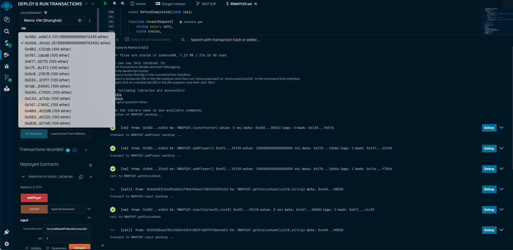
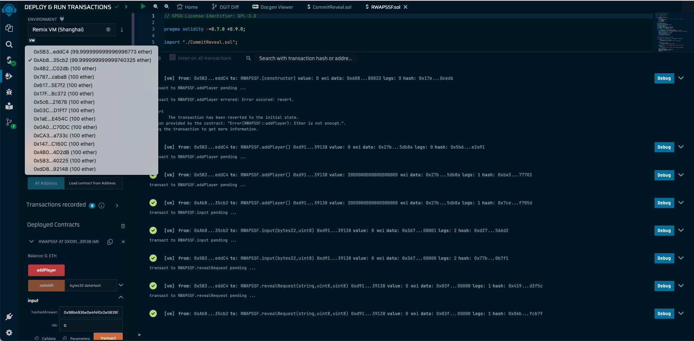

# RPS

## Github

[Github](https://github.com/hirasawaau/RPS)

## How to play

1. Click on `addPlayer` to register and pay `PRICE` to contract
2. Think about choice and salt then call `getChoiceHash` push the choice and salt as arguments to function. It will return the bytes hash for next step.
3. Transact `input` with your hash and your idx that you got from first step.
4. Waiting another player commit the hash
5. Reveal your hash, transact `revealRequest` push your salt,choices and idx as arguments to function.
6. Waiting your income ^\_^

## Security

### Front Runner

Fixed with the Commit-Reveal strategy by player must hash his/her choice with salt then commit his/her hash to contract another player can't know about choice that player selected. When two players have selected completely, Two players will reveal his choice and compare their choices.

## Timeout

### No another player join the contract

In `addPlayer` contract give 5 minutes to waiting another player join but if no player join to contract, player can refund his/her money from the contract to his/her pocket.

### Player decision for long time

Contract gives you 5 minutes for decision your choice and commit the hash if another player doesn't commit the hash player can refund money and take another player's money to his/her pocket.

### Player not revealed for long time

Contract gives you 3 minutes from last player committing for reveal your choice if another player doesn't reveal the choice player can refund money and take another player's money to his/her pocket.

## Modified Code
- Change `uint256` to `uint8` for `numPlayer`, `numInput`
- Add `numReveal` for counting reveal players
- Add Error Message
- Add event for function
## Example

### Win and Lose

### Deal

